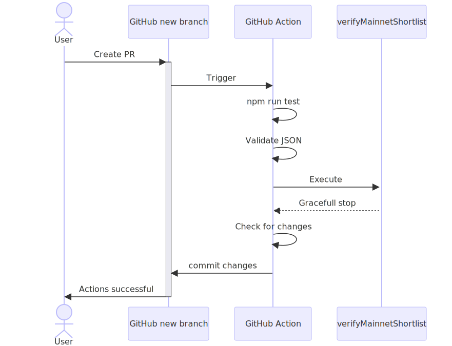
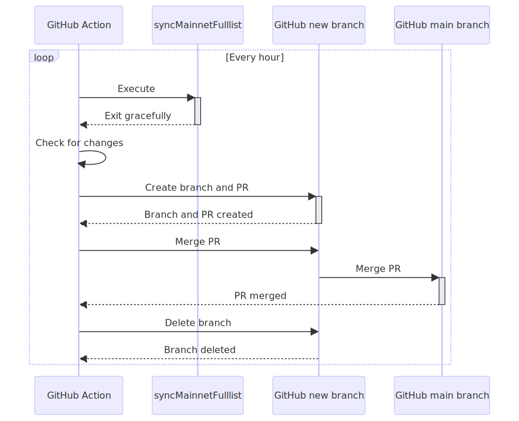
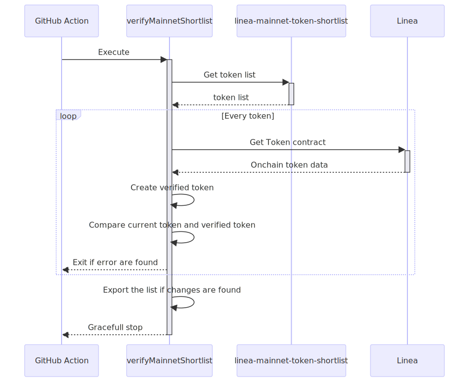
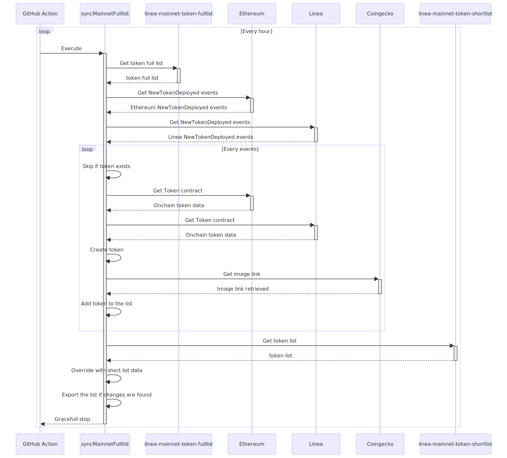

# Linea Token List - Technical Processes

This document provides an overview of the automated systems in place for managing the Linea Token List. It details the GitHub Actions set up for synchronization, validation, and testing, as well as the scripts executed for token updates, both community-initiated and auto-synced from on-chain data.

## Token list updates processes

### Community Token List updates

#### Description

Step-by-step procedure through which community members can propose token updates. It begins with a user creating a new branch and ends with the pull request (PR) being merged after validation.

#### Sequence diagram

    

Mermaid source: [Community Token List updates diagram](./mermaid/diagrams/community-token-list-updates.mmd)

### Verify and Test

#### Description

Validates JSON structures and runs unit tests for every push and pull request on the main branch.

#### Features

- Triggered by pull requests to the main branch.
- Executes unit tests.
- Validates linea-goerli-token-shortlist.json against its JSON schema.
- Executes verifyMainnetShortlist.
- Commit changes if changes are detected.

#### Sequence diagram

    

Mermaid source: [Community Token List updates diagram](./mermaid/diagrams/verify-mainnet-shortlist-action.mmd)

### File

[.github/workflows/verify-and-test.yml](../.github/workflows/verify-and-test.yml)

### Sync on-chain Token List

#### Description

Automatically syncs the on-chain token list every hour. For an in-depth execution flow, refer to the [Script Execution Guide](./script-execution.md).

### File

[.github/workflows/sync-mainnet-fulllist.yml](../.github/workflows/sync-mainnet-fulllist.yml)

#### Features

- Runs hourly.
- Executes verifyMainnetShortlist.
- Generates an updated token list from on-chain data.
- Creates a pull request if changes are detected.
- Auto-merges and cleans up the PR branch.

#### Sequence diagram

    

Mermaid source: [Community Token List updates diagram](./mermaid/diagrams/sync-mainnet-fulllist-action.mmd)

## Script Execution

Technical workflows associated with updating the Linea Token List. It covers both community-initiated updates and automated synchronization from on-chain data.

### Automatic Mainnet Token List Verification

#### Description

Script that retrieves the Mainnet Token Shortlist, verifies each token's on-chain data, updates any discrepancies, and gracefully terminates after the entire verification process.

#### Sequence diagram

    

Mermaid source: [Automatic Sync Mainnet Token List diagram](./mermaid/diagrams/verify-mainnet-shortlist.mmd)

### File

[scripts/verifyMainnetShortlist.ts](../scripts/verifyMainnetShortlist.ts)

### Automatic Sync Mainnet Token List

#### Description

Script for synchronizing the Mainnet Token List directly from on-chain data. Triggered every hour, it encompasses stages from fetching event data from Ethereum to merging updates into the main branch after validation.

#### Sequence diagram

    

Mermaid source: [Automatic Sync Mainnet Token List diagram](./mermaid/diagrams/sync-mainnet-fulllist.mmd)

### File

[scripts/syncMainnetFulllist.ts](../scripts/syncMainnetFulllist.ts)
